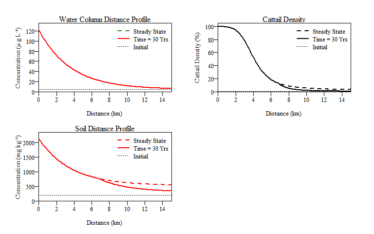

EPGMr
================

[](https://zenodo.org/badge/latestdoi/234599925)

**Contact Info:** [Webpage](http://swampthingecology.org) -
[Twitter](https://twitter.com/SwampThingPaul) -
[Email](mailto:pauljulianphd@gmail.com)

-----

## Table of Contents

  - [Task List](#tasks)
  - [Background](#background)
  - [Introduction](#intro)
  - [Citing package](#cite)
  - [Installation](#install)
  - [Functions](#func)
      - [*Distance Profile*](#profile)
      - [*Time Profile*](#time)
      - [*Threshold Evaluation*](#threshold)
      - [*User input example*](#user)
  - [Potential errors](#errors)

-----

## Task List <a name="tasks"></a>

  - [x] Distance profile function, `EPGMProfile()` with plots.
  - [x] Add summary reults table to distance profile function,
    `EPGMProfile()`.
  - [x] Develop time-series function, `EPGMTime()`.
      - [x] Develope time-series results summary function.
  - [x] Develop threshold evaluation function.
  - [x] Figure out how to code greek (i.e. mu) and superscript for `.Rd`
    files.
  - [x] ~~[rOpenSci](https://ropensci.org/) presubmission inquiry.
    [Link](https://github.com/ropensci/software-review/issues/365)~~
  - [ ] ~~Submit to [rOpenSci](https://ropensci.org/) for community
    peer-review.~~
  - [ ] Submit to [CRAN](https://cran.r-project.org/submit.html).

-----

## Background <a name="background"></a>

This package is an R-version of the original Everglades Phosphorus
Gradient Model developed by Walker and Kadlec and implements the model
described in:

  - Walker WW, Kadlec, R.H. (1996) A Model for Simulating Phosphorus
    Concentrations in Waters and Soils Downstream of Everglades
    Stormwater Treatment Areas. U.S. Department of the Interior. Links
    to: [Report](http://www.wwwalker.net/epgm/epgm_Aug_1996_1_of_2.pdf);
    [Appendix](http://www.wwwalker.net/epgm/epgm_Aug_1996_2_of_2.pdf).

The model is further discussed in:

  - Kadlec RH, Walker WW (1999) Management models to evaluate phosphorus
    impacts on wetlands. In: Reddy KR, O’Conner GA, Schelske CL (eds)
    Phosphorus Biogeochemistry in Subtropical Ecosystems. Lewis
    Publishers, Boca Raton, FL, pp 621–639.

  - Walker WW, Kadlec RH (2011) Modeling Phosphorus Dynamics in
    Everglades Wetlands and Stormwater Treatment Areas. Critical Reviews
    in Environmental Science and Technology 41:430–446.

## Introduction <a name="intro"></a>

Everglades Phosphorus Gradient Model (EPGM; Fig. 1) predicts variations
in water-column phosphorus (P) concentration, peat accretion rate, and
soil P concentration along a horizontal gradient imposed by an external
P load and sheet-flow conditions. Cattail densities and total areas are
predicted based upon correlations with soil P and are surrogates for
impacts on ecosystem components which respond to soil P variations in
similar concentration ranges. The model is calibrated to soil and
vegetation data from Water Conservation Area - 2 (WCA-2; primarily),
WCA-1, and WCA-3A. The model successfully simulates observed
[longitudinal gradients in soil P concentration below the S10 structures
in WCA-2A](http://www.wwwalker.net/epgm/wca2a_gradient.htm) after \~28
years of external P loading (1962 to 1990). Observed expansion of
cattail populations in this region between 1973 and 1991 is also
simulated, though somewhat over-predicted during the first 20 years.
Model results suggest a linear relationship between marsh water-column
and soil P concentrations over long time scales. Estimated soil response
times range from 20 to 40 years, depending on soil depth, and are
inversely related to water-column concentration.


**Figure 1:** Generalized model structure of the Everglades Phosphorus
Gradient Model as originally developed by Walker and Kadlec. The model
embodies water and phosphorus mass conservation specific to wetland
ecosystems designed for phosphorus management.

## Citing package <a name="cite"></a>

A lot of time and effort went into the development of the original
[EPGM](http://wwwalker.net/epgm/index.htm) and it is important to give
the authors proper credit. This is the ultimate foundation of this `R`
package.

  - Walker WW, Kadlec, R.H. (1996) A Model for Simulating Phosphorus
    Concentrations in Waters and Soils Downstream of Everglades
    Stormwater Treatment Areas. U.S. Department of the Interior

It also took time in developement of the `EPGMr`, translating the
spreadsheet model into the `R` environment. To see a current citation
for `EPGMr`, use the following command in `R`:

``` r
citation('EPGMr')
```

    ## 
    ## To cite package 'EPGMr' in publications use:
    ## 
    ##   Paul Julian (2020). EPGMr: Implementation of the
    ##   Everglades Phosphorus Gradient Model in R. R
    ##   package version 1.0.0.
    ##   https://github.com/swampthingpaul/EPGMr
    ## 
    ## A BibTeX entry for LaTeX users is
    ## 
    ##   @Manual{,
    ##     title = {EPGMr: Implementation of the Everglades Phosphorus Gradient Model in R},
    ##     author = {Paul Julian},
    ##     year = {2020},
    ##     note = {R package version 1.0.0},
    ##     url = {https://github.com/swampthingpaul/EPGMr},
    ##   }

## Installation <a name="install"></a>

``` r
install.packages("devtools");# if you do not have it installed on your PC
devtools::install_github("SwampThingPaul/EPGMr")
```

## Functions <a names="func"></a>

For the examples below we are going to use an internal dataset within
this package. This is also the data provided in the orginal
[EPGM](http://www.wwwalker.net/epgm/) as case study examples. To see
these data use the `data()` function. This internal package data is a
table of variables from data provided in the original EPGM model. This
data (and the original) has 12 examples (cases) of phosphorus inputs,
hydrologic information (inflow volume, rainfall, evapotranspiration and
hydroperiod), soil depth of interest, soil characteristics, and soil
gradient values. Examples include dicharges from Stormwater Treatment
Area (STA) 2, 3/4, 5, 6 and the S10 structures.

``` r
data("casedat")
```

Case number 11 is data from the S10 structures that discharge into
northeast Water Conservation area 2A, the historic eutrophication
gradient within the Everglades ecosystem.

``` r
#I transposed the data for easy viewing. 
t(casedat[casedat$case.number==11,])
```

    ##                                 11       
    ## case.number                     "11"     
    ## STA.Name                        "S10s"   
    ## Receiving.Area                  "NE 2A"  
    ## Start.Discharge                 "1962"   
    ## STA.outflow.TPconc              "122"    
    ## STA.outflow.vol                 "281.3"  
    ## FlowPath.width                  "10.5"   
    ## Hydroperiod                     "91.4"   
    ## Soil.Depth                      "10"     
    ## Soil.BulkDensity.initial        "0.102"  
    ## Soil.TPConc.initial             "198"    
    ## Vertical.SoilTPGradient.initial "-0.0018"
    ## Soil.BulkDensity.final          "0.08"   
    ## PSettlingRate                   "10.2"   
    ## P.AtmoDep                       "42.9"   
    ## Rainfall                        "1.16"   
    ## ET                              "1.38"

`EPGMr` is broken into three functions.

  - `EPGMProfile` simulates the phopshorus gradient (distance
    downstream) during a specified simulation period (default: 30
    years). The function as defaulted also provides a summary results
    output and plot of water column total P, soil P and cattail density
    along the gradient. Graphical output includes steady state
    simulation and time at the simulation period (default: 30 years).

  - `EPGMTime` uses `EPGMProfile` to simulate yearly P dynamics along
    the gradient for a specified period (default: 200 years) thereby
    simulating changes in P along the gradient over time. Similar to
    `EPGMProfile` as defaulted a summary table is provided based on
    distance intervals specified in the `Dist.slice` argument in the
    function (default is `c(0,0.5,1,2,5,10)`). Also as a default a
    series of time plots are generated for soil P and cattail density.

  - `EPGMThreshold` evaluates raw outputs from `EPGMTime` relative to
    thresholds for water column, soil and cattail density. As a default
    it provides a summary table and plot.

*Distance Profile*<a name="profile"></a>

This will run the example case number 11, plot the distance profile
depicited below and provide a summary results table. If `raw.output` was
set to `TRUE`, the raw data behind the plots and summary tables would be
printed in the console. If `results.table` was set to `TRUE` then a
summary results table will be printed (default). The results output
table under `$DistanceProfile` provides a summary of the simulation
period at several user input distances, however the default argument in
the function is `summary.distance=c(0,0.5,1,2,4,8,10)`. Other
information in the summary result tab include, simulation inputs, water
budget, phosphorus mass balance and information on regarding soils for
the simulation period (default is 30 years).

``` r
EPGMProfile(case.no=11,plot.profile=TRUE,summary.distance=c(0,1,2,4,10))
```


    ## $Time.yrs
    ## [1] 30
    ## 
    ## $Simulated.Zone
    ##                    Parameter Value
    ## 1                Distance.km  15.0
    ## 2                   Width.km  10.5
    ## 3                   Area.km2 157.5
    ## 4 STA.outflow.volume.kAcftyr 281.3
    ## 5            Hydroperiod.pct  91.4
    ## 6              Soil.Depth.cm  10.0
    ## 7          P.Settle.Rate.myr  10.2
    ## 8       STA.outflow.Conc.ugL 122.0
    ## 9      STA.outflow.Load.mtyr  42.4
    ## 
    ## $DistanceProfile
    ##                                       0       1       2
    ## WaterCol.Pconc.ugL               122.00   93.70   72.10
    ## SteadyState.WC.Conc.ugL          122.00   93.70   72.10
    ## SteadyState.Soil.Conc.mgkg      2131.00 1744.00 1449.00
    ## Time.to.Steady.State.yrs          15.00   16.00   17.20
    ## NewSoil.Depth.cm                  10.00   10.00   10.00
    ## Soil.Mass.Accret.kgm2yr            0.67    0.63    0.58
    ## Cattail.Density.pct              100.00   99.00   95.00
    ## SteadyState.Cattail.Density.pct  100.00   99.00   95.00
    ##                                       4     10
    ## WaterCol.Pconc.ugL                43.10  11.50
    ## SteadyState.WC.Conc.ugL           43.10  11.50
    ## SteadyState.Soil.Conc.mgkg      1053.00 620.00
    ## Time.to.Steady.State.yrs          20.90  46.30
    ## NewSoil.Depth.cm                  10.00   6.50
    ## Soil.Mass.Accret.kgm2yr            0.48   0.22
    ## Cattail.Density.pct               53.00   2.00
    ## SteadyState.Cattail.Density.pct   53.00   5.00
    ## 
    ## $Water.Budget
    ##          Total.Flow.m Total.Flow.hm3 Sim.Avg.Flow.myr
    ## Inflow          66.14          10417             2.20
    ## Rainfall        34.80           5481             1.16
    ## ET              41.40           6520             1.38
    ## Outflow         59.54           9378             1.98
    ## 
    ## $P.MassBalance
    ##          PMass.mgm2 PMass.mtons Sim.Avg.Load.mgm2yr
    ## Inflow         8069      1270.9               269.0
    ## Rainfall       1493       235.1                49.8
    ## Removal        8986      1415.3               299.5
    ## Outflow         576        90.7                19.2
    ## 
    ## $Soils
    ##                 SoilMass.kgm2 PMass.mgm2 PConc.mgkg
    ## Initial Storage         10.20       2020        198
    ## Current Storage          8.46       6761        800
    ## Accretion                8.22       8986       1093
    ## Burial                   9.97       4245        426
    ##                 BulkDensity.gcm3 PVol.mgcm3
    ## Initial Storage            0.102      0.020
    ## Current Storage            0.085      0.068
    ## Accretion                  0.080      0.087
    ## Burial                     0.097      0.041

*Time Profile*<a name="time"></a>

This function will run the EPGM model over a determined period of time
(with specificied time increment). If `raw.time.output` is set to
`TRUE`, the raw data behind the plots and summary tables will be printed
in the console and/or saved as an object. This will results in a
`data.frame` with data specific to space (i.e. distance) and time
(i.e. year).

``` r
EPGMTime(case.no=11)
```

<!-- -->

    ## $Time.yrs
    ## [1] 200
    ## 
    ## $Time.increment.yrs
    ## [1] 5
    ## 
    ## $Simulated.Zone
    ##                    Parameter  Value
    ## 1                Distance.km   15.0
    ## 2                   Width.km   10.5
    ## 3                   Area.km2  157.5
    ## 4 STA.outflow.volume.kAcftyr  281.3
    ## 5            Hydroperiod.pct 9140.0
    ## 6              Soil.Depth.cm   10.0
    ## 7          P.Settle.Rate.myr   10.2
    ## 8       STA.outflow.Conc.ugL  122.0
    ## 9      STA.outflow.Load.mtyr   42.4
    ## 
    ## $TimeProfile
    ##   Time.Step Year SoilP.mgkg CattailDensity.ha
    ## 1         0 1961        198                47
    ## 2         5 1966        335               226
    ## 3        10 1971        476              1603
    ## 4        15 1976        622              3201
    ## 5        20 1981        715              4238
    ## 6        25 1986        765              4615
    ## 7        30 1991        800              4755
    ## 8        35 1996        826              4830
    ## 9       200 2161        902              5005

*Threshold Evaluation*<a name="threshold"></a>

This function will calculate, summarise and plot area exceedance for
results from `EPGMTime()`. Currently the function is configured to
evaluate three threshold for water column, soil and cattail density
within the modelled flow-path. Much like the other functions, If
`raw.area.output` is set to `TRUE`, then the raw results summarized in
the summary table and plots will be provided as a `data.frame`.

``` r
example<-EPGMTime(case.no=11,raw.time.output=TRUE,plot.profile=FALSE)

EPGMThreshold(example)
```

<!-- -->

    ## $TotalArea.km2
    ## [1] 157.5
    ## 
    ## $Thresholds
    ##            Thresholds Value1 Value2 Value3
    ## 1 Water Column (ug/L)     10     15     20
    ## 2        Soil (mg/kg)    500    600   1000
    ## 3 Cattail Density (%)      5     20     90
    ## 
    ## $WaterColumn
    ##    Time.Step Year   WC.10  WC.15  WC.20
    ## 1          0 1961   0.000  0.000  0.000
    ## 2          5 1966 113.925 89.775 76.125
    ## 3         10 1971 113.925 89.775 76.125
    ## 4         15 1976 113.925 89.775 76.125
    ## 5         20 1981 113.925 89.775 76.125
    ## 6         25 1986 113.925 89.775 76.125
    ## 7         30 1991 113.925 89.775 76.125
    ## 8         35 1996 113.925 89.775 76.125
    ## 41       200 2161 113.925 89.775 76.125
    ## 
    ## $Soil
    ##    Time.Step Year Soil.500 Soil.600 Soil.1000
    ## 1          0 1961    0.000    0.000     0.000
    ## 2          5 1966   23.625   13.125     0.000
    ## 3         10 1971   50.925   40.425    15.225
    ## 4         15 1976   67.725   56.175    30.975
    ## 5         20 1981   80.325   67.725    42.525
    ## 6         25 1986   90.825   78.225    45.675
    ## 7         30 1991   99.225   85.575    45.675
    ## 8         35 1996  107.625   92.925    45.675
    ## 41       200 2161  157.500  113.925    45.675
    ## 
    ## $Cattail
    ##    Time.Step Year Cattail.5 Cattail.20 Cattail.90
    ## 1          0 1961     0.000      0.000      0.000
    ## 2          5 1966    12.075      0.000      0.000
    ## 3         10 1971    39.375     23.625      1.575
    ## 4         15 1976    55.125     39.375     18.375
    ## 5         20 1981    66.675     50.925     25.725
    ## 6         25 1986    77.175     59.325     25.725
    ## 7         30 1991    84.525     61.425     25.725
    ## 8         35 1996    91.875     61.425     25.725
    ## 41       200 2161   108.675     61.425     25.725

*User input example*<a name="user"></a>

Below is an example of the `EPGMProfile` function with user input data
rather than case specific data.

``` r
#User defined inputs
Discharge.Yr <- 1962
Out.TPconc <- 122
out.Q <- 281.3
FP.width <- 10.5
HP.per <- 91.4
Soil.z <- 10
Soil.BDi <- 0.102
Soil.TPi <- 198
TPGradient.i <- -0.0018
Soil.BDf <- 0.08
k <- 10.2
P.dep <- 42.9
RF <- 1.23
ET <- 1.38

EPGMProfile(
  Start.Discharge = Discharge.Yr,
  STA.outflow.TPconc = Out.TPconc, 
  STA.outflow.vol = out.Q, 
  FlowPath.width = FP.width,
  Hydroperiod = HP.per, 
  Soil.Depth = Soil.z, 
  Soil.BulkDensity.initial = Soil.BDi,
  Soil.TPConc.initial = Soil.TPi, 
  Vertical.SoilTPGradient.initial = TPGradient.i,
  Soil.BulkDensity.final = Soil.BDf, 
  PSettlingRate = k, 
  P.AtmoDep = P.dep,
  Rainfall = RF, ET = ET,
  summary.distance=c(0,1,5,10))
```



    ## $Time.yrs
    ## [1] 30
    ## 
    ## $Simulated.Zone
    ##                    Parameter Value
    ## 1                Distance.km  15.0
    ## 2                   Width.km  10.5
    ## 3                   Area.km2 157.5
    ## 4 STA.outflow.volume.kAcftyr 281.3
    ## 5            Hydroperiod.pct  91.4
    ## 6              Soil.Depth.cm  10.0
    ## 7          P.Settle.Rate.myr  10.2
    ## 8       STA.outflow.Conc.ugL 122.0
    ## 9      STA.outflow.Load.mtyr  42.4
    ## 
    ## $DistanceProfile
    ##                                       0       1      5
    ## WaterCol.Pconc.ugL               122.00   93.50  33.50
    ## SteadyState.WC.Conc.ugL          122.00   93.50  33.50
    ## SteadyState.Soil.Conc.mgkg      2131.00 1742.00 921.00
    ## Time.to.Steady.State.yrs          15.00   16.00  23.60
    ## NewSoil.Depth.cm                  10.00   10.00  10.00
    ## Soil.Mass.Accret.kgm2yr            0.67    0.63   0.42
    ## Cattail.Density.pct              100.00   99.00  31.00
    ## SteadyState.Cattail.Density.pct  100.00   99.00  31.00
    ##                                     10
    ## WaterCol.Pconc.ugL               11.50
    ## SteadyState.WC.Conc.ugL          11.50
    ## SteadyState.Soil.Conc.mgkg      621.00
    ## Time.to.Steady.State.yrs         46.20
    ## NewSoil.Depth.cm                  6.50
    ## Soil.Mass.Accret.kgm2yr           0.22
    ## Cattail.Density.pct               2.00
    ## SteadyState.Cattail.Density.pct   5.00
    ## 
    ## $Water.Budget
    ##          Total.Flow.m Total.Flow.hm3 Sim.Avg.Flow.myr
    ## Inflow          66.14          10417             2.20
    ## Rainfall        36.90           5812             1.23
    ## ET              41.40           6520             1.38
    ## Outflow         61.64           9708             2.05
    ## 
    ## $P.MassBalance
    ##          PMass.mgm2 PMass.mtons Sim.Avg.Load.mgm2yr
    ## Inflow         8069      1270.9               269.0
    ## Rainfall       1583       249.3                52.8
    ## Removal        8971      1413.0               299.0
    ## Outflow         681       107.2                22.7
    ## 
    ## $Soils
    ##                 SoilMass.kgm2 PMass.mgm2 PConc.mgkg
    ## Initial Storage         10.20       2020        198
    ## Current Storage          8.45       6756        799
    ## Accretion                8.22       8971       1091
    ## Burial                   9.97       4235        425
    ##                 BulkDensity.gcm3 PVol.mgcm3
    ## Initial Storage            0.102      0.020
    ## Current Storage            0.085      0.068
    ## Accretion                  0.080      0.087
    ## Burial                     0.097      0.041

## Potential errors <a name="errors"></a>

1.  If internal data is being used to run the model and the user selects
    a case number not in the list.

<!-- end list -->

``` r
EPGMProfile(case.no=14)
```

    ## Error in EPGMProfile(case.no = 14): 'case.no' range from 1 to 12.

2.  If `raw.output=TRUE` and `results.table=TRUE` at its current stands
    the function will default to the results table and plot with a
    warning.

<!-- end list -->

``` r
EPGMProfile(
  case.no=11,
  summary.distance=c(0,1,5,10),
  raw.output=TRUE,
  results.table=TRUE)
```

    ## Warning in EPGMProfile(case.no = 11, summary.distance = c(0,
    ## 1, 5, 10), : Can't have raw.output and results.table, You
    ## can't have your cake and eat it too.


    ## $Time.yrs
    ## [1] 30
    ## 
    ## $Simulated.Zone
    ##                    Parameter Value
    ## 1                Distance.km  15.0
    ## 2                   Width.km  10.5
    ## 3                   Area.km2 157.5
    ## 4 STA.outflow.volume.kAcftyr 281.3
    ## 5            Hydroperiod.pct  91.4
    ## 6              Soil.Depth.cm  10.0
    ## 7          P.Settle.Rate.myr  10.2
    ## 8       STA.outflow.Conc.ugL 122.0
    ## 9      STA.outflow.Load.mtyr  42.4
    ## 
    ## $DistanceProfile
    ##                                       0       1      5
    ## WaterCol.Pconc.ugL               122.00   93.70  33.60
    ## SteadyState.WC.Conc.ugL          122.00   93.70  33.60
    ## SteadyState.Soil.Conc.mgkg      2131.00 1744.00 923.00
    ## Time.to.Steady.State.yrs          15.00   16.00  23.50
    ## NewSoil.Depth.cm                  10.00   10.00  10.00
    ## Soil.Mass.Accret.kgm2yr            0.67    0.63   0.42
    ## Cattail.Density.pct              100.00   99.00  32.00
    ## SteadyState.Cattail.Density.pct  100.00   99.00  32.00
    ##                                     10
    ## WaterCol.Pconc.ugL               11.50
    ## SteadyState.WC.Conc.ugL          11.50
    ## SteadyState.Soil.Conc.mgkg      620.00
    ## Time.to.Steady.State.yrs         46.30
    ## NewSoil.Depth.cm                  6.50
    ## Soil.Mass.Accret.kgm2yr           0.22
    ## Cattail.Density.pct               2.00
    ## SteadyState.Cattail.Density.pct   5.00
    ## 
    ## $Water.Budget
    ##          Total.Flow.m Total.Flow.hm3 Sim.Avg.Flow.myr
    ## Inflow          66.14          10417             2.20
    ## Rainfall        34.80           5481             1.16
    ## ET              41.40           6520             1.38
    ## Outflow         59.54           9378             1.98
    ## 
    ## $P.MassBalance
    ##          PMass.mgm2 PMass.mtons Sim.Avg.Load.mgm2yr
    ## Inflow         8069      1270.9               269.0
    ## Rainfall       1493       235.1                49.8
    ## Removal        8986      1415.3               299.5
    ## Outflow         576        90.7                19.2
    ## 
    ## $Soils
    ##                 SoilMass.kgm2 PMass.mgm2 PConc.mgkg
    ## Initial Storage         10.20       2020        198
    ## Current Storage          8.46       6761        800
    ## Accretion                8.22       8986       1093
    ## Burial                   9.97       4245        426
    ##                 BulkDensity.gcm3 PVol.mgcm3
    ## Initial Storage            0.102      0.020
    ## Current Storage            0.085      0.068
    ## Accretion                  0.080      0.087
    ## Burial                     0.097      0.041

3.  If the `Dist.increment.km` is greater than the `Max.Dist` arguments,
    the function will stop and provide a warning.

<!-- end list -->

``` r
EPGMProfile(
  case.no=11,
  Dist.increment.km=16,
  Max.Dist=15)
```

    ## Error in EPGMProfile(case.no = 11, Dist.increment.km = 16, Max.Dist = 15): Distance increment is greater than the maximum gradient distance.

4.  `summary.distance` values must be positve, so can’t back look behind
    the discharge with this model.

<!-- end list -->

``` r
EPGMProfile(
  case.no=11,
  summary.distance=-1)
```

    ## Error in EPGMProfile(case.no = 11, summary.distance = -1): Distance values much be equal to or greater than zero
